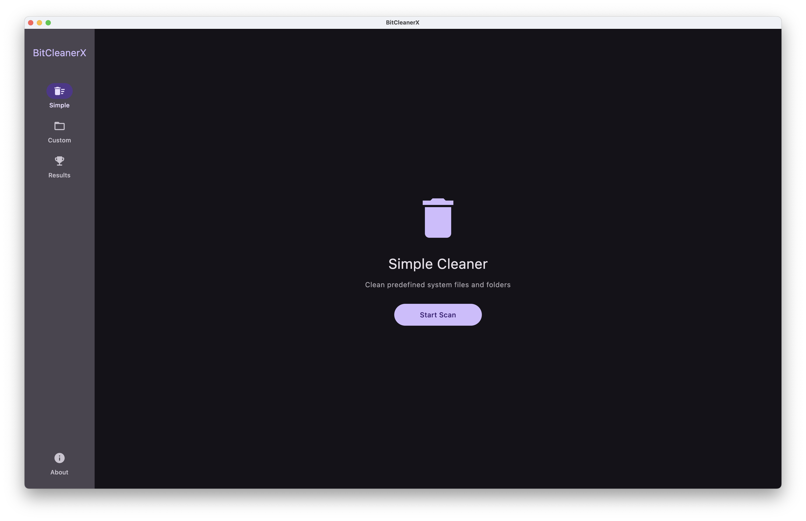
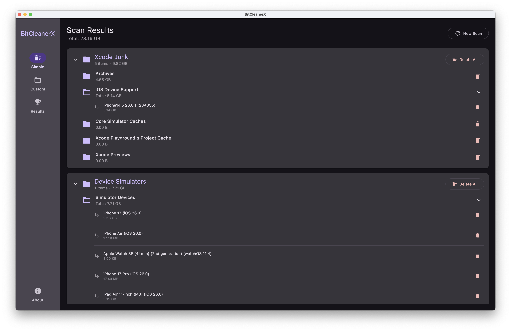
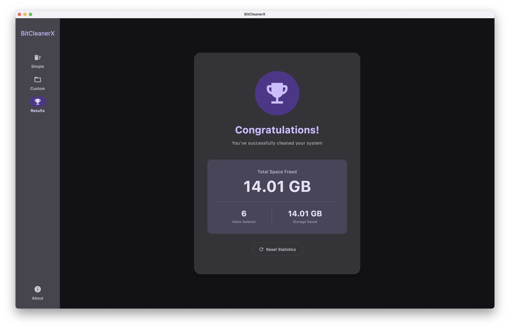
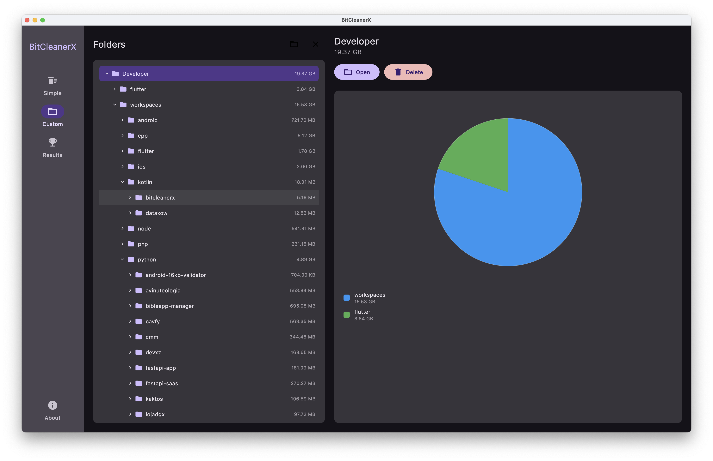
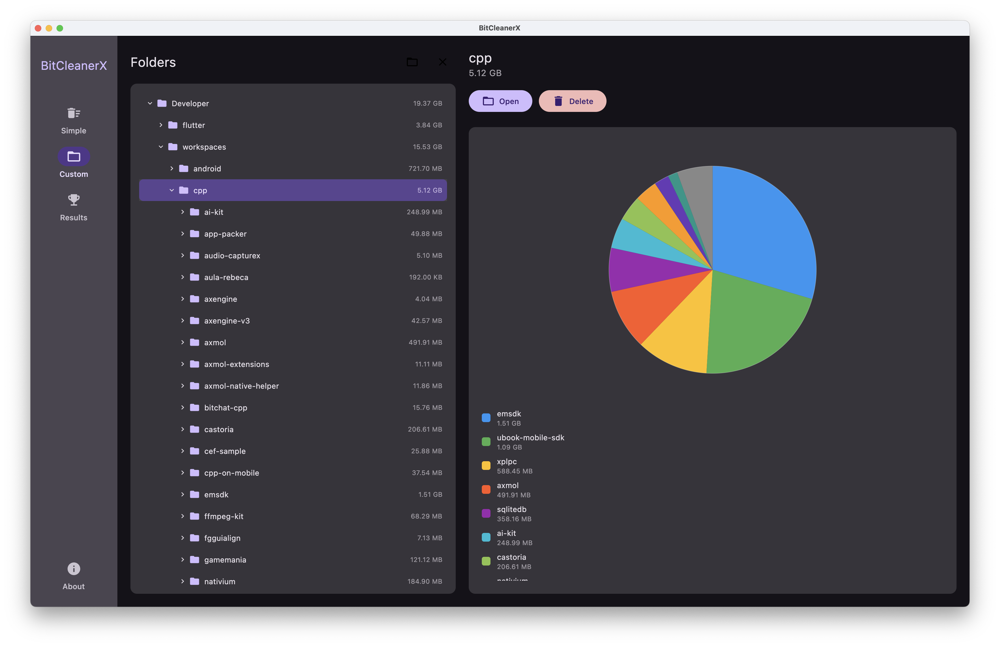

# BitCleanerX

A cross-platform desktop application for cleaning up system junk files and freeing up disk space.

## Features

### Simple Cleaner
Clean predefined system files and folders with a single click:
- Scans configured directories for common junk files
- Groups items by category (cache, logs, derived data, etc.)
- Shows total size of reclaimable space
- Displays human-readable names for system folders (e.g., Xcode simulators)
- Allows selective deletion of items or entire groups

### Custom Cleaner
Analyze and clean any directory on your system:
- Choose any folder to scan
- Visual pie chart showing space distribution
- Navigate through directory tree
- View detailed size information for each subdirectory
- Delete specific folders or files

### Results Screen
Track your cleaning progress:
- Total space cleaned
- Number of items deleted
- Reset statistics

## Platform Support

- **macOS** - Full support with macOS-specific optimizations
- **Windows** - Supported with PowerShell integration
- **Linux** - Supported with standard Unix tools

## OS-Specific Features

### macOS
- Xcode simulator cleanup with device names (e.g., "iPhone 15 Pro (iOS 17.0)")
- Xcode DerivedData cleanup
- iOS device support logs
- CocoaPods cache
- Open in Finder integration

### Windows
- PowerShell-based directory scanning
- Open in Explorer integration

### Linux
- Fast directory scanning with `du` command
- xdg-open file manager integration

## Configuration

The Simple Cleaner uses a YAML configuration file (`config.yaml`) to define cleanable items for each platform. You can customize which directories and files to scan.

## Technology Stack

- **Kotlin Multiplatform** - Cross-platform application logic
- **Compose Multiplatform** - Modern UI framework
- **Coroutines** - Asynchronous operations
- **Material Design 3** - Clean and modern interface

## Build & Distribution

### Building from Source

```bash
# Run the application
./gradlew run

# Generate installers for your current platform
./gradlew packageDistributionForCurrentOS

# Platform-specific installers
./gradlew packageDmg    # macOS
./gradlew packageMsi    # Windows
./gradlew packageDeb    # Linux
```

The generated installers will be available in `composeApp/build/compose/binaries/main/`.

### Environment Variables

For **macOS** distribution with code signing and notarization, you need to set the following environment variables:

- `SIGNING_IDENTITY` - Your Apple Developer certificate identity (e.g., "Developer ID Application: Your Name (TEAM_ID)")
- `NOTARIZATION_APPLE_ID` - Your Apple ID email address
- `NOTARIZATION_TEAM_ID` - Your Apple Developer Team ID
- `NOTARIZATION_PASSWORD` - App-specific password for notarization (generate at appleid.apple.com)

### References

- **Native Distribution**: [Compose Multiplatform Native Distributions Tutorial](https://github.com/JetBrains/compose-multiplatform/blob/master/tutorials/Native_distributions_and_local_execution/packaging-tools-comparison.md)

### Plugins Versions

- `org.jetbrains.kotlin.multiplatform`: [Gradle Plugin Portal](https://plugins.gradle.org/plugin/org.jetbrains.kotlin.multiplatform)
- `org.jetbrains.compose`: [Gradle Plugin Portal](https://plugins.gradle.org/plugin/org.jetbrains.compose)
- `org.jetbrains.kotlin.plugin.compose`: [Gradle Plugin Portal](https://plugins.gradle.org/plugin/org.jetbrains.kotlin.plugin.compose)
- `org.jetbrains.compose.hot-reload`: [Gradle Plugin Portal](https://plugins.gradle.org/plugin/org.jetbrains.compose.hot-reload)
- `org.jetbrains.kotlin.plugin.serialization`: [Gradle Plugin Portal](https://plugins.gradle.org/plugin/org.jetbrains.kotlin.plugin.serialization)

## Screenshots






